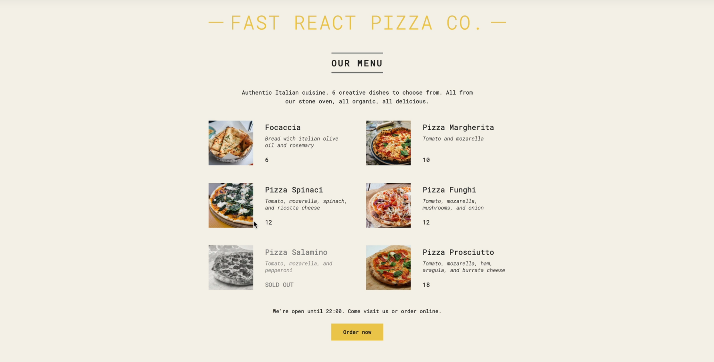

# Pizza menu

## Table of contents

- [✅ Project completed](#project-completed-repo)
- [⌛️ Project starter](#project-starter-repo)
- [🧩 Concepts](#concepts-to-review-for-this-project)
- [🎯 Learning goal](#learning-goal)
- [💻 Application Overview](#overview)
  - [📸Screenshot](#screenshot)
  - [🥷🏽 The challenge](#the-challenge)
  - [🔗Links](#links)
- [🪜 My process](#my-process)

## Project completed repo

- check out the code here `->` [completed](https://github.com/hermkan/)

## Project starter repo

- check out the code here `->` [starter](https://github.com/hermkan/)

## Concepts to review for this project

- JSX, Components, Props

## Learning Goal

In building this application, you will sharpen your skills in React components by practicing using props as well as defining, rendering, and referencing components.

## Overview

### Screenshot

### The challenge

The challenge is to build out this table and get it looking as close to the design as possible.

### Links

- Live Site URL: [Table HTML](/)

## My process

<!-- In this project, we built a pizza menu for a fictionnal restaurant!

The most important component is the Pizza Menu.

In the **public folder/**, there is a file named `data.js` which contains an array of pizza objects with _name_, _ingredients_, _price_, _photoName_, and _soldOut_ as its properties. We used this to populate the pizza menu card.

The menu component will be composed of Card components, which will be comprised of a photo and a description.

Next,`App.js` contains the top-level component. The data in `data.js` is retrieved in`App.js` and flow downward from App to Card.

`index.js` renders the App component. `style.css` and `index.html` handle the markup and styling. -->

<!-- ### -->

<!-- I started with the card component. The card compoent is responsible for showing the description and photo of a pizza. It will work with the _photoName_ property of our passed-down comments object extracted from commentData.js -->

### Built with

- React
- CSS

<!-- Let’s start with the smallest component, the Body. The Body is responsible for showing the comments that users have written. It will work with the comment property of our passed-down comments object extracted from commentData.js.

Open up Body.js and define your Body component.

This component should receive props. This props object contains all of the data on our comment, such as the username, profile image, and comment, but the Body works specifically with only the comment property.

Have the component return a 
 element that contains the comment property from props.

Stuck? Get a hint
3.
Export the Body component after its function definition so that it can be imported and used in Card.js.

Stuck? Get a hint
4.
Open Header.js and define your Header component.

This component will be responsible for the profileImg and username properties of our passed-down comments object.

The Header component should receive props. The component should return two elements, an  element whose src attribute will receive the profileImg property from props, and a <h1> element, displaying username from props.

Stuck? Get a hint
5.
Export the Header component after its function definition so that it can be imported and used in Card.js.

Stuck? Get a hint
Setting Up Card
6.
Great job! Let’s take a brief detour back to App.js.

Currently, the App component is empty. This is the top-level component and it is responsible for returning the interface to be rendered. In this case, it will be returning an instance of the Card component for every comment in commentData.js.

In the App component body, map over the comments array with the argument named comment and return an instance of the Card component.

For each component, give it an attribute named commentObject and the value {comment}.

Stuck? Get a hint
7.
Nice! You’ve set up App to pass down information to the Card component. Let’s put the pieces together.

Open Card.js and import the Header and Body components. Card will be the outer “shell” that contains our two smaller components: Card is the parent, and Header and Body are the child components.

Begin defining the Card component. Card should receive props.

Card should return an instance of the Header component, and an instance of the Body component.

Stuck? Get a hint
8.
Previously in App.js, you’ve passed down a commentObject attribute to Card which contains an object with three properties (profileImg, username, and comment).

It’s time to access those and finally pass them to the children components: Header and Body.

Header expects two props, profileImg and username.

Give the Header instance an attribute named profileImg and the value of props.commentObject.profileImg.

Stuck? Get a hint
9.
Next, give the Header instance an attribute named username and the value of props.commentObject.username.

Stuck? Get a hint
10.
The Body instance expects a comment prop.

Give the Body instance an attribute named comment and the value of props.commentObject.comment.

Stuck? Get a hint
11.
Now, export the Card component so it can be imported and used.

Stuck? Get a hint
Rendering the Application
12.
Open up App.js again, and import the Card component which is now defined and exported.

Stuck? Get a hint
13.
Then, export the App component.

Stuck? Get a hint
14.
Open up index.js and import the App component.

Stuck? Get a hint
15.
As you may recall, index.js is largely responsible for only rendering the App component.

Use .createRoot() to supply a container where you will render the App component. Then, use .render() to render it into the DOM!

If you’ve succeeded, you should see three comments rendered on the web browser, engaging in a riveting discussion about animals. -->
